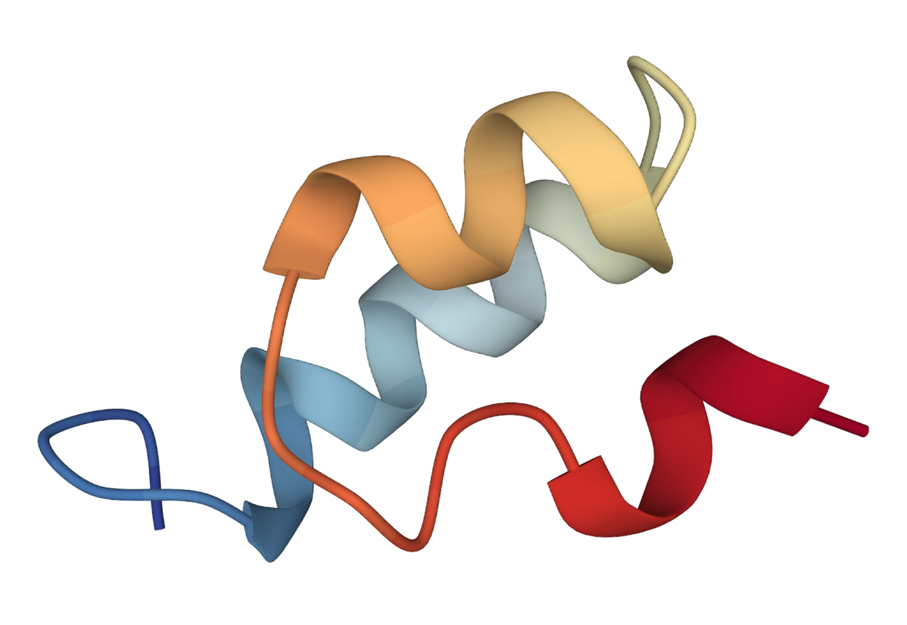
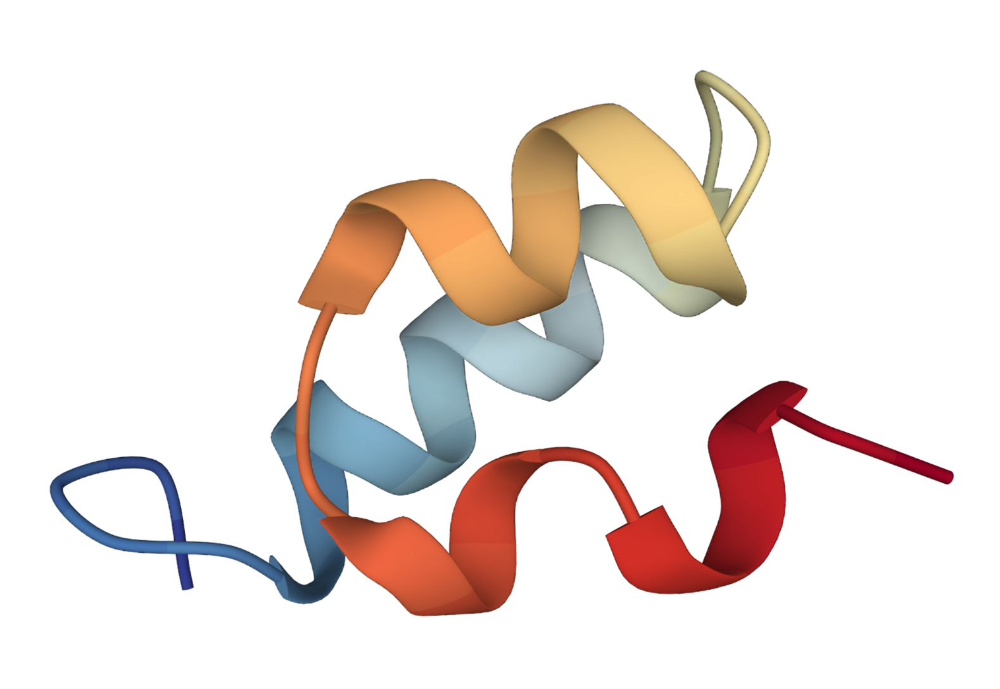
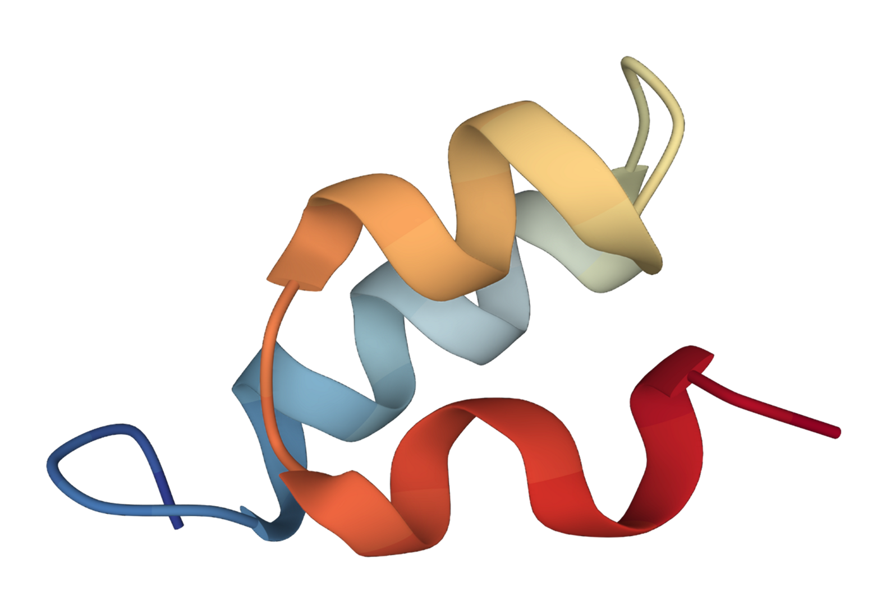
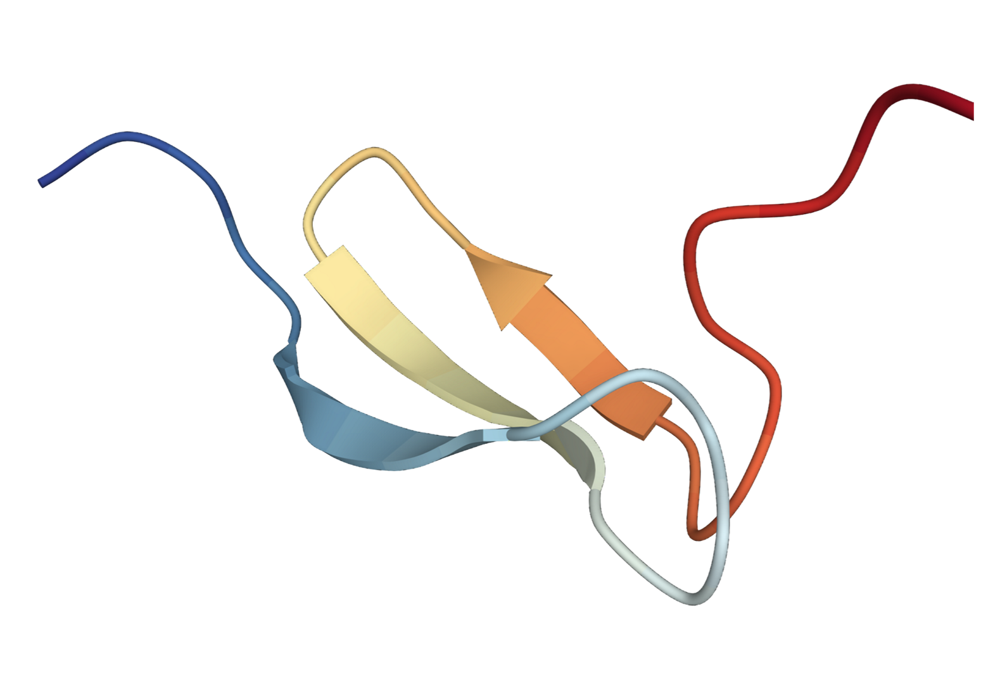
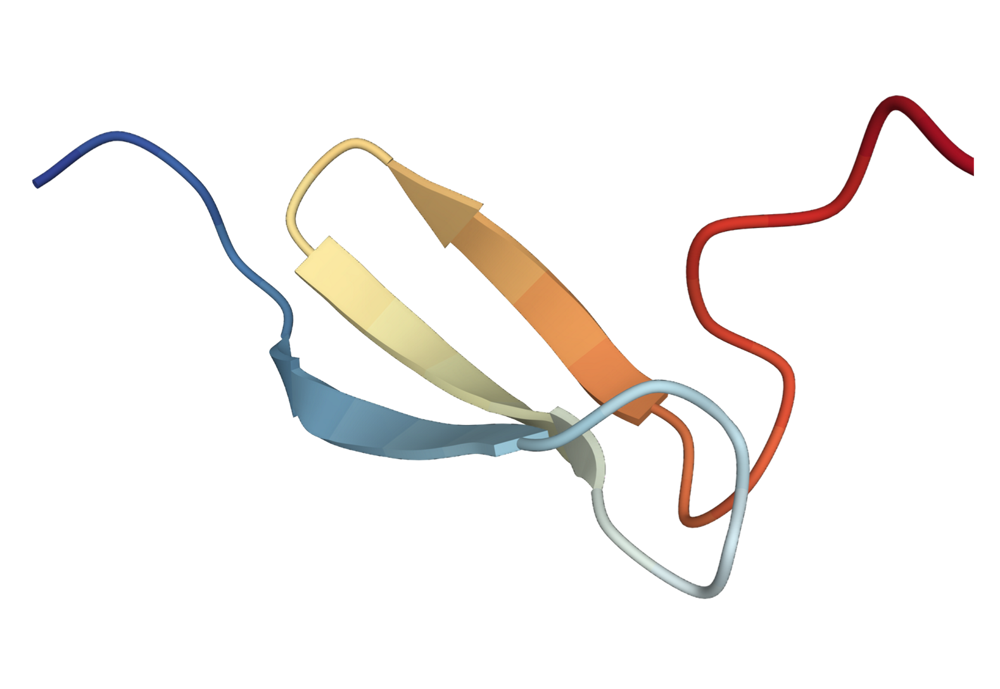
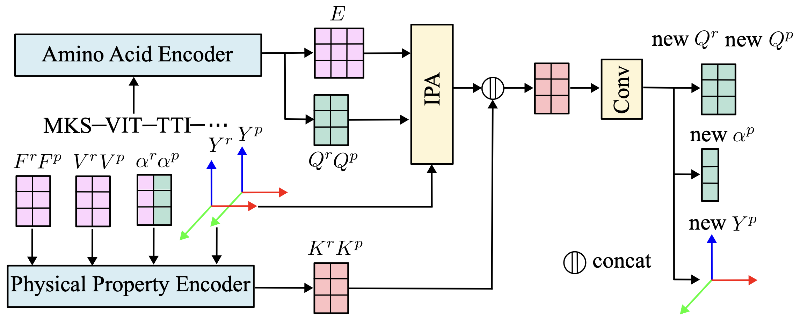

<h1 align='center'>Dynamic PDB: A New Dataset and a SE(3) Model Extension by Integrating Dynamic Behaviors and Physical Properties in Protein Structures</h1>

<div align='center'>
    Ce Liu<sup>1*</sup>&emsp;
    Jun Wang<sup>1*</sup>&emsp;
    Zhiqiang Cai<sup>1*</sup>&emsp;
    Yingxu Wang<sup>1,3</sup>&emsp;
    Huizhen Kuang<sup>2</sup>&emsp;
    Kaihui Cheng<sup>2</sup>&emsp;
    Liwei Zhang<sup>1</sup>&emsp;
</div>
<div align='center'>
    Qingkun Su<sup>1</sup>&emsp;
    Yining Tang<sup>2</sup>&emsp;
    Fenglei Cao<sup>1</sup>&emsp;
    Limei Han<sup>2</sup>&emsp;
    <a href='https://sites.google.com/site/zhusiyucs/home/' target='_blank'>Siyu Zhu</a><sup>2†</sup>&emsp;
    Yuan Qi<sup>2†</sup>&emsp;
</div>

<div align='center'>
    <sup>1</sup>Shanghai Academy of Artificial Intelligence for Science&emsp;
    <sup>2</sup>Fudan University&emsp;
    <br>
    <sup>3</sup>Mohamed bin Zayed University of Artificial Intelligence
</div>

<table>
  <tr>
    <td align="center">
      
    </td>
  </tr>
</table>

## Overview

**Dynamic PDB** is a large-scale dataset that enhances existing prestigious static 3D protein structural databases, such as the Protein Data Bank (PDB), by integrating dynamic data and additional physical properties. It contains approximately 12.6k filtered proteins, each subjected to all-atom molecular dynamics (MD) simulations to capture conformational changes.

Compared with previously existing protein MD datasets, dynamic PDB provides three key advancements:

1. **`Extended simulation durations`**: Up to 1 microsecond per protein, facilitating a more comprehensive understanding of significant conformational changes.
2. **`Finer-grained sampling intervals`**: 1 picosecond intervals, allowing for the capture of more detailed allosteric pathways.
3. **`Enriched array of physical properties`**: Captured during the MD process, including atomic velocities and forces, potential/kinetic energies, and the temperature of the simulation environment, etc.

## What dynamic PDB contains?

The attributes contained in dynamic PDB are listed as follows:

| File Name | Attribute | Data Type | Unit |
| --- | --- | --- | --- |
| `{protein_id}_T.pkl` | Trajectory coordinates | float array | Å |
| `{protein_id}_V.pkl` | Atomic velocities | float array | Å/ps |
| `{protein_id}_F.pkl` | Atomic forces | float array | kcal/mol·Å |
| `{protein_id}_npt_sim.dat` | Potential energy<br>Kinetic energy<br>Total energy<br>Temperature<br>Box volume<br>System density | float<br>float<br>float<br>float<br>float<br>float | kJ/mole<br>kJ/mole<br>kJ/mole<br>K<br>nm³<br>g/mL |

In addition, the following data are stored during the MD simulation:

| File Name | Description |
| --- | --- |
| `{protein_id}_minimized.pdb` | PDB structure after minimization |
| `{protein_id}_nvt_equi.dat` | Information in NVT equilibration |
| `{protein_id}_npt_equi.dat` | Information in NPT equilibration |
| `{protein_id}_T.dcd` | DCD format for trajectory coordinates |
| `{protein_id}_state_npt1000000.0.xml` | Status file for MD prolongation |

## Data Availability Notice

Thank you for your interest and support in our dataset. Due to the immense size of the full simulation data and storage limitations, we have decided to provide the 100ns simulation data for all proteins for online download, with detailed usage instructions provided below ([Download Dataset](#download-dataset)). For researchers who require the 1µs simulation data for specific proteins, please fill out an agreement to the [dynamicPDB Terms of Use](assets/dynamicPDB_Terms_of_Use.pdf), using your institutional email addresses, and send it to us at caizhiqiang@sais.com.cn, along with the PDB IDs. We will provide the data individually. The full list of PDB IDs can be downloaded [here](assets/PDB_ID.csv).

## Download Dataset

You can easily get dynamic PDB dataset from our [ModelScope repo](https://www.modelscope.cn/datasets/fudan-generative-vision/dynamicPDB/).

1. Make sure you have Git LFS installed:
```shell
sudo apt-get install git-lfs
# Initialize Git LFS
git lfs install
```

2. Navigate to your `DATA_ROOT` and clone the source:

```shell
GIT_LFS_SKIP_SMUDGE=1 git clone https://www.modelscope.cn/datasets/fudan-generative-vision/dynamicPDB.git dynamicPDB_raw
```
`GIT_LFS_SKIP_SMUDGE=1` configures Git to clone the pointers for all LFS files.

3. Download data with a specific `protein_id`, for example `1a62_A`:

```shell
cd dynamicPDB_raw
git lfs pull --include="{protein_id}/*"
```

4. Merge the split-volume compression into one file and then unzip the `.tar.gz` file:

```shell
cat {protein_id}/{protein_id}.tar.gz.part* > {protein_id}/{protein_id}.tar.gz
cd ${Your Storage Root}
mkdir dynamicPDB  # ignore if directory exists
tar -xvzf dynamicPDB_raw/{protein_id}/{protein_id}.tar.gz -C dynamicPDB
```

Finally, the dataset should be organized as follows:

```text
./dynamicPDB/
|-- 1a62_A_npt100000.0_ts0.001
|   |-- 1a62_A_npt_sim_data
|   |   |-- 1a62_A_npt_sim_0.dat
|   |   `-- ...
|   |-- 1a62_A_dcd
|   |   |-- 1a62_A_dcd_0.dcd
|   |   `-- ...
|   |-- 1a62_A_T
|   |   |-- 1a62_A_T_0.pkl
|   |   `-- ...
|   |-- 1a62_A_F
|   |   |-- 1a62_A_F_0.pkl
|   |   `-- ...
|   |-- 1a62_A_V
|   |   |-- 1a62_A_V_0.pkl
|   |   `-- ...
|   |-- 1a62_A.pdb
|   |-- 1a62_A_minimized.pdb
|   |-- 1a62_A_nvt_equi.dat
|   |-- 1a62_A_npt_equi.dat
|   |-- 1a62_A_T.dcd
|   |-- 1a62_A_T.pkl
|   |-- 1a62_A_F.pkl
|   |-- 1a62_A_V.pkl
|   `-- 1a62_A_state_npt100000.0.xml
|-- 1ah7_A_npt100000.0_ts0.001
|   |-- ...
|   `-- ...
`-- ...
```

For ease of use, we have also provided segmented versions of the data (directories `{protein_id}_dcd`, `{protein_id}_T`, `{protein_id}_F`, and `{protein_id}_V`), each representing one-tenth of the total simulation duration, sequentially named from 0 to 9 in chronological order. The files `{protein_id}_T.dcd`, `{protein_id}_T.pkl`, `{protein_id}_F.pkl`, `{protein_id}_V.pkl` are their corresponding combination.

## Applications
### Trajectory Prediction
We extend the SE(3) diffusion model to incorporate sequence features and physical properties for the task of trajectory prediction.  
Specifically, given an initial 3D structure of the protein, the task is to predict 3D structure at the next time step. 

#### Showcase
We present the predicted 3D structures by our method and SE(3)-Trans.  
<table class="center">
  <tr>
    <td style="text-align: center"><b>SE(3) Trans</b></td>
    <td style="text-align: center"><b>Ours</b></td>
    <td style="text-align: center"><b>Ground Truth</b></td>
  </tr>
  <tr>
    <td style="text-align: center"></a></td>
    <td style="text-align: center"></a></td>
    <td style="text-align: center"></a></td>
  </tr>
  <tr>
    <td style="text-align: center"></a></td>
    <td style="text-align: center"></a></td>
    <td style="text-align: center"></a></td>
  </tr>
</table> 


#### Framework
We present the network architecture, where the predicted 3D structures are conditioned on the amino acid sequence and physical properties.  
<table>
  <tr>
    <td align="center">
      
    </td>
  </tr>
</table>


#### Installation
```bash
  pip install -r requirements.txt
  pip install .
```
#### Data Preparation
```text
./DATA/
|-- 16pk_A
|   |-- 16pk_A.pdb
|   |-- 16pk_A.npz
|   |-- 16pk_A_new_w_pp.npz
|   |-- 16pk_A_F_Ca.pkl
|   `-- 16pk_A_V_ca.pkl
|-- 1b2s_F
|   |-- ...
|   `-- ...
`-- ...
```
For each protein xxxx_x,      
the xxxx_x.pdb is the pdb file for protein;  
the xxxx_x.npz is the node features and edge features from OmegaFold; produced by ./data_preprocess/extract_embedding.py  
the xxxx_x_new_w_pp.npz is the trajectory of the protein; produced by first ./data_preprocess/post_process.py and then ./data_preprocess/post_process.py;prep_atlas_with_forces.py;  
the xxxx_x_F_Ca.pkl is the force of C alpha atoms of the protein; produced by ./data_preprocess/atom_select.py;    
the xxxx_x_V_ca.pkl is the velocity of C alpha atoms of the protein; produced by ./data_preprocess/atom_select.py;  

Prepare a list of proteins for training in train_proteins.csv as below:
|name|seqres|release_date|msa_id|atlas_npz|embed_path|seq_len|force_path|vel_path|pdb_path|
|----|----|----|----|----|----|----|----|----|----|
|16pk_A|EKKSIN...|1998/11/25|16pk_A|./DATA/16pk_A/16pk_A_new_w_pp.npz|./DATA/16pk_A/16pk_A.npz|415|./DATA/16pk_A/16pk_F_Ca.pkl|./DATA/16pk_A/16pk_V_ca.pkl|./DATA/16pk_A/16pk.pdb|
|...|

Similarly, prepare for the test_proteins.csv

#### Training
```shell
sh run_train.sh
```
Key arguments in run_train.sh:  
data.keep_first: we use frames in [0, data.keepfirst) in each trajectory for training  
csv_path: the path for train_proteins.csv

#### Inference
```shell
sh run_eval.sh
```
Key arguments in run_eval.sh:  
model_path: path of pretrained models  
start_idx: the time index in the trajectory for evaluation   
data.test_csv_path: path for test_proteins.csv  

#### Acknowledgements
We would like to thank the contributors to the [OpenFold](https://github.com/aqlaboratory/openfold), [OmegaFold](https://github.com/HeliXonProtein/OmegaFold).  
If we missed any open-source projects or related articles, we would like to complement the acknowledgement of this specific work immediately.

