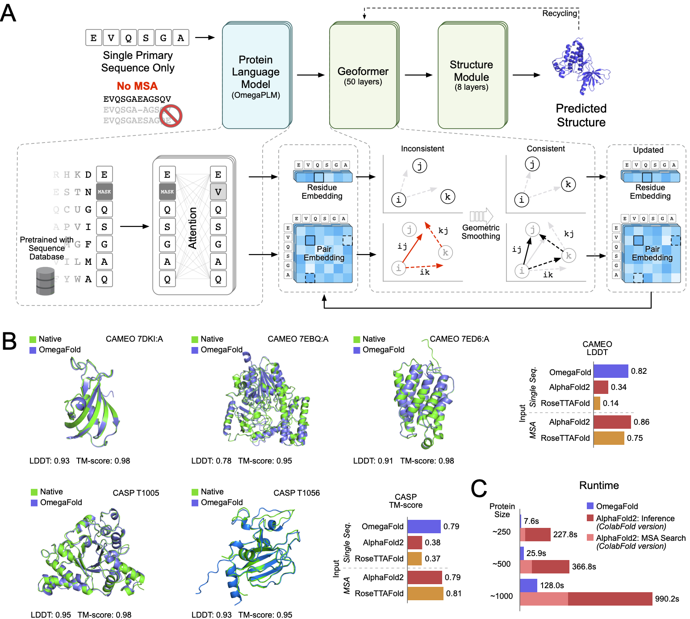

# OmegaFold: High-resolution de novo Structure Prediction from Primary Sequence

#### This is the release code for paper [High-resolution de novo structure prediction from primary sequence](https://www.biorxiv.org/content/10.1101/2022.07.21.500999v1).

We will continue to optimize this repository for more ease of use, for
instance, reducing the GRAM required to inference long proteins and
releasing possibly stronger models.

## Update Notes

We have optimized (to some extent) the GRAM usage of OmegaFold model in our
latest release. Now the model can inference protein sequence as long as
_4096_ on NVIDIA A100 Graphics card with 80 GB of memory with
`--subbatch_size` set to 448 without hitting full memory.
This version's model is more sensitive to `--subbatch_size`.

### Setting Subbatch

Subbatch makes a trade-off between time and space.
One can greatly reduce the space requirements by setting `--subbatch_size`
very low.
The default is the number of residues in the sequence and the lowest
possible number is 1.
For now we do not have a rule of thumb for setting the `--subbatch_size`,
but we suggest half the value if you run into GPU memory limitations.

### MacOS Users

For macOS users, we support MPS (Apple Silicon) acceleration if the user
installs the latest nightly version of PyTorch.
Also, current code also requires macOS users need to `git clone` the
repository and use `python main.
py` (see below) to run the model.

## Setup

To prepare the environment to run OmegaFold,

- from source

```commandline
pip install git+https://github.com/HeliXonProtein/OmegaFold.git
```

- clone the repository

```commandline
git clone https://github.com/HeliXonProtein/OmegaFold
cd OmegaFold
python setup.py install
```

should get you where you want.

The `INPUT_FILE.fasta` should be a normal fasta file with possibly many
sequences with a comment line starting with `>` or `:` above the amino
acid sequence itself.

This command will download the weight
from https://helixon.s3.amazonaws.com/release1.pt
to `~/.cache/omegafold_ckpt/model.pt`
and load the model

## Running

You could simply

```commandline
omegafold INPUT_FILE.fasta OUTPUT_DIRECTORY
```

And voila!

### Alternatively (Or MacOS users)

Even if this failed, since we use minimal 3rd party libraries, you can
always just install the latest
[PyTorch](https://pytorch.org) and [biopython](https://biopython.org)
(and that's it!) yourself.
For mps accelerator, macOS users may need to install the lastest nightly
version of PyTorch.
In this case, you could run

```commandline
python main.py INPUT_FILE.fasta OUTPUT_DIRECTORY
```

### Notes on resources

However, since we have implemented sharded execution, it is possible to

1. trade computation time for GRAM: by changing `--subbatch_size`. The
   smaller
   this value is, the longer the execution can take, and the less memory is
   required, or,
2. trade computation time for average prediction quality, by changing
   `--num_cycle`

For more information, run

```commandline
omegafold --help
```

where we provide several options for both speed and weights utilities.

## Output

We produce one pdb for each of the sequences in `INPUT_FILE.fasta` saved in
the `OUTPUT_DIRECTORY`. We also put our confidence value the place of
b_factors in pdb files.

## Cite

If this is helpful to you, please consider citing the paper with

```tex
@article{OmegaFold,
	author = {Wu, Ruidong and Ding, Fan and Wang, Rui and Shen, Rui and Zhang, Xiwen and Luo, Shitong and Su, Chenpeng and Wu, Zuofan and Xie, Qi and Berger, Bonnie and Ma, Jianzhu and Peng, Jian},
	title = {High-resolution de novo structure prediction from primary sequence},
	elocation-id = {2022.07.21.500999},
	year = {2022},
	doi = {10.1101/2022.07.21.500999},
	publisher = {Cold Spring Harbor Laboratory},
	URL = {https://www.biorxiv.org/content/early/2022/07/22/2022.07.21.500999},
	eprint = {https://www.biorxiv.org/content/early/2022/07/22/2022.07.21.500999.full.pdf},
	journal = {bioRxiv}
}

```

## Note

Also some of the comments might be out-of-date as of now, and will be
updated very soon